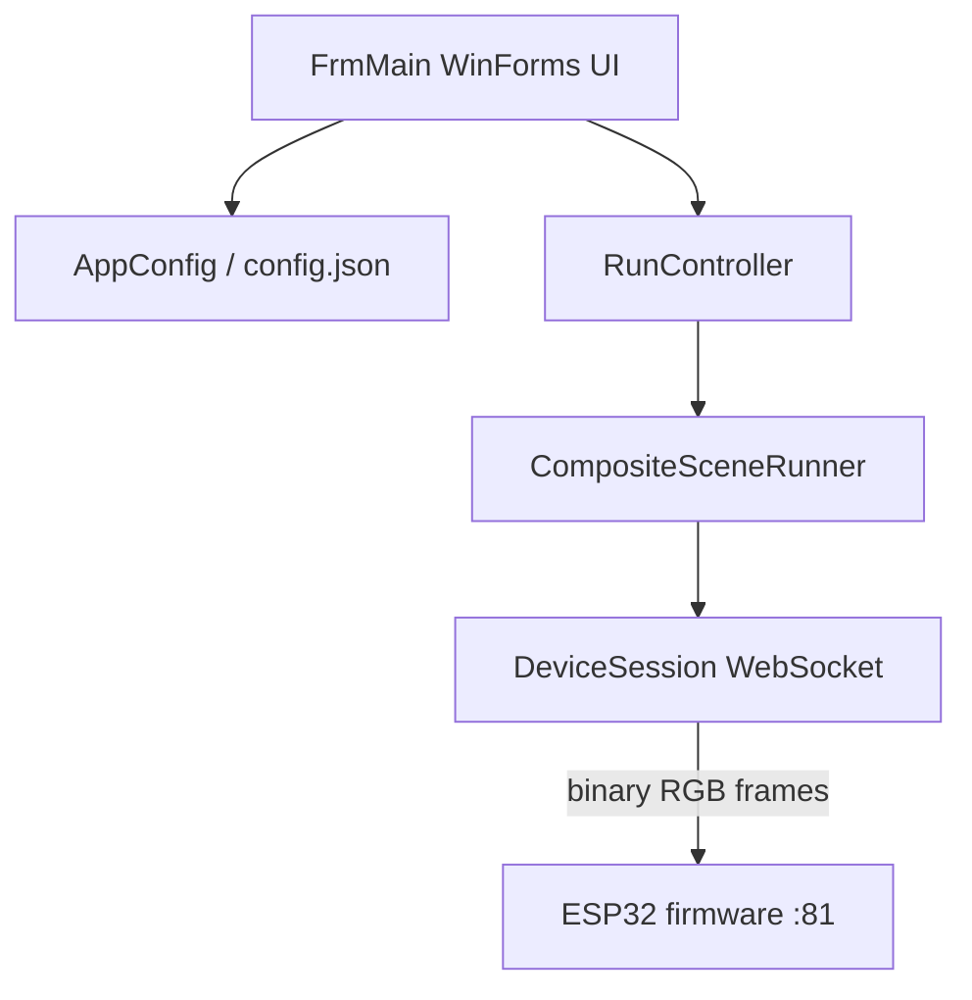

# Visualedizer Client

Windows desktop application for composing lighting scenes and streaming them to Visualedizer ESP32 devices in real time.

The client captures system audio, monitor content, and image files, maps the results onto LED strips, and sends binary RGB frames over WebSocket. Configuration is persisted locally in `config.json`.

## Requirements

- Windows 10 or later
- [.NET 10 SDK](https://dotnet.microsoft.com/download) (target framework: `net10.0-windows7.0`)
- Visualedizer firmware running on reachable ESP32 devices

## Dependencies

| Package | Purpose |
|---------|---------|
| [NAudio](https://github.com/naudio/NAudio) 2.2.1 | Windows audio capture and analysis |

## Build and Run

From the repository root:

```powershell
dotnet build Client/Visualedizer/Visualedizer.csproj
dotnet run --project Client/Visualedizer/Visualedizer.csproj
```

Or open `Client/Visualedizer.sln` in Visual Studio.

The executable writes `config.json` next to the binary on first run. If the app is already running and locks the output folder, build to an alternate directory:

```powershell
dotnet build Client/Visualedizer/Visualedizer.csproj -p:OutDir=..\..\tmpbuild\
```

## Architecture



### Core components

| File | Role |
|------|------|
| `FrmMain.cs` | Main window: device grid, scene grid, collection grid, audio device selection, run lifecycle |
| `AppConfig.cs` | Load/save devices, scenes, collections, shortcuts, and global settings from `config.json` |
| `SceneConfig.cs` | Scene type definitions, device/strip models, collection snapshot models, display names and summaries |
| `SceneRunners.cs` | Runtime rendering; `CompositeSceneRunner` builds per-device frames |
| `RunController.cs` | Manages WebSocket connections and the render loop per device |
| `DeviceMetadataService.cs` | Queries device HTTP `/get-conf` to discover strips and LED counts |
| `GlobalShortcutManager.cs` | Observes global keyboard shortcuts for collection toggle/hold/reset |
| `AcVolume.cs` / `AcSpectralAnalysis.cs` | Audio capture helpers |
| `CaptureScenePreview.cs` | Preview payloads for screen/image capture scenes |

Each device with enabled output targets gets its own `RunController`. When configuration changes, runs are reconciled automatically, and only affected devices restart. Collection playback temporarily stops normal runs, streams frozen snapshot settings, then resumes the current live configuration on reset or hold-release.

## Scene Types

| Type | Source | Notes |
|------|--------|-------|
| `SolidColor` | Config only | Static HSV color |
| `Gradient` | Config only | HSV gradient across assigned LEDs |
| `VolumeReactive` | System audio | Maps volume level to LED positions; multiple visualization modes |
| `SpectralAnalysis` | System audio | Maps frequency bands to LED positions |
| `ScreenRowCapture` | Monitor pixel row | Captures one horizontal scan line from a selected display |
| `ImageRowCapture` | Image file or folder | Scans rows through a still image or image sequence |
| `LaserDmx` | Auxiliary device | Builds DMX channel payloads for laser output |
| `Strobe` | Auxiliary device | Builds strobe payloads |

Scenes are stored independently from devices. LED strip rows reference LED-capable scenes by ID. Device rows reference laser and strobe scenes by ID. Multiple strips on one controller can use different scenes; the runner composites them into a single frame sized to the device's total LED count.

### Audio visualization modes

Volume and spectral scenes support these mapping modes (see `AcVolume.AudioCaptureVolumeMode`):

- Start to end / End to start
- Mid to out / Mid to out (point)
- Color push
- Brightness

## Device Configuration

Devices are defined in the UI and saved in `config.json`.

| Field | Description |
|-------|-------------|
| `host` | Device IP address or hostname |
| `port` | WebSocket port (default **81**) |
| `ledCount` | Total LEDs across all strips |
| `stripCount` | Number of addressable strips on the device |
| Device row `enabled` | Enables device-level auxiliary output for laser/strobe scenes |
| `assignedLaserSceneId` | Laser scene for the device row |
| `assignedStrobeSceneId` | Strobe scene for the device row |
| Strip row `enabled` | Enables LED streaming for that strip |
| Per-strip fields | Each strip stores `enabled`, `ledCount`, and `assignedSceneId` |

When adding a device, the client calls the firmware HTTP API to auto-fill strip metadata. Every discovered strip is shown as a child row, including one-strip devices. Refresh metadata from the device grid if hardware changes.

## Collections

The bottom Collections grid stores snapshots of the currently enabled outputs:

| Output | Captured From |
|--------|---------------|
| LED strips | Enabled strip rows and their assigned scene configuration |
| Laser | Enabled device rows with an assigned laser scene |
| Strobe | Enabled device rows with an assigned strobe scene |

Snapshots store cloned scene configurations, so later edits to the main scene list do not change existing collections. Ctrl+clicking a collection row starts it as a latched override until the reset shortcut or Stop collection button is used. A collection shortcut can run in toggle mode or hold mode. Toggle mode streams until reset; hold mode streams on key-down and stops on key-up. Starting another collection replaces the current override.

### WebSocket protocol

The client connects to `ws://<host>:<port>` and sends **binary** messages containing contiguous RGB bytes:

```
frame length = totalLedCount Ă— 3
byte order   = R, G, B per LED, index 0 first
```

When the WebSocket disconnects, the firmware turns off all strips.

## Configuration File

`config.json` stores the complete client state:

| Property | Contents |
|----------|----------|
| `delay` | Global frame delay in milliseconds |
| screen-capture trigger fields | Trigger coordinates for auxiliary devices |
| `scenes` | Scene definitions and type-specific parameters |
| `devices` | Device host, port, strip layout, and scene assignments |
| `collections` | Frozen snapshot collections, activation mode, shortcuts, and cloned scene configs |
| `resetShortcut` | Global shortcut used to stop the active collection override |

Older JSON config versions are normalized on load. Old device-level LED assignments are migrated onto generated strip rows so existing effects keep streaming under the newer row semantics.

## Project Structure

```text
Client/
|-- Visualedizer.sln
`-- Visualedizer/
    |-- Program.cs                  # Entry point
    |-- FrmMain.cs                  # Main form
    |-- AppConfig.cs                # JSON persistence
    |-- SceneConfig.cs              # Scene and device models
    |-- SceneRunners.cs             # Frame rendering
    |-- RunController.cs            # WebSocket sessions
    |-- DeviceMetadataService.cs    # HTTP device discovery
    |-- GlobalShortcutManager.cs    # Global collection shortcuts
    |-- ShortcutCaptureForm.cs      # Shortcut assignment dialog
    |-- AcVolume.cs                 # Volume-reactive audio
    |-- AcSpectralAnalysis.cs       # Spectral audio analysis
    |-- CaptureScenePreview.cs      # Capture scene previews
    |-- *SceneEditorForm.cs         # Per-scene editor panels
    |-- UcHue*.cs                   # Shared HSV editor controls
    `-- SKILL.md                    # Guide for adding new scene types
```

## Adding a New Scene Type

Follow the checklist in [Visualedizer/SKILL.md](Visualedizer/SKILL.md). At minimum, a new scene requires changes to:

1. `SceneConfig.cs` - enum, config class, clone, display name, summary
2. `AppConfig.cs` - JSON save/load
3. A new `*SceneEditorForm` - WinForms editor implementing `ISceneEditorForm`
4. `FrmMain.cs` - register the editor
5. `SceneRunners.cs` - frame builder inside `CompositeSceneRunner`

## Troubleshooting

| Issue | Check |
|-------|-------|
| Device shows "Faulted" | Verify IP, port 81, and that firmware is running; check Windows firewall |
| Wrong LED count | Refresh device metadata; confirm firmware profile matches physical strip |
| No audio reaction | Select the correct playback device in the main form |
| Screen capture empty/wrong | Confirm monitor index and capture row; run client on the display being captured |
| Config not restored | Ensure `config.json` sits beside the executable, not the project source folder |
