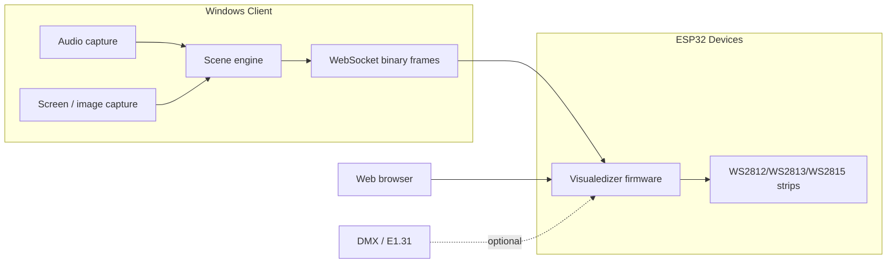

# Visualedizer

DIY audio and ambient lighting visualization using ESP32 controllers, WS281x addressable LED strips, and a Windows desktop client.

Visualedizer is a two-part system:

- **[Client](Client/README.md)** — a Windows app that captures audio, screen, and image sources, composes lighting scenes, and streams RGB frames to one or more devices over WebSocket.
- **[Server](Server/README.md)** — ESP32 firmware that drives LED strips, exposes a web UI and REST/WebSocket API, and can also run built-in effects locally.

## How It Works



1. Flash the firmware to each ESP32 controller and connect LED strips.
2. Run the Windows client, add devices by IP address, and assign scenes to devices or individual strips.
3. The client renders each scene into RGB byte frames (`ledCount × 3`) and sends them to the firmware on port **81**.
4. Devices can also be controlled independently through the built-in web UI, HTTP API, IR remote, or DMX.

## Supported Hardware

| Component | Examples |
|-----------|----------|
| Controllers | Seeed XIAO ESP32S3, M5Stack Stamp S3, M5Stamp C3 |
| LED strips | WS2812B, WS2813, WS2815 |
| Host PC | Windows 10/11 with .NET 10 runtime |

Pre-configured firmware profiles exist for furniture, desk, ceiling, wardrobe, printer, and Kubis installations. See [Server/README.md](Server/README.md) for per-device LED counts, pin maps, and build environments.

## Scene Types (Client)

| Scene | Description |
|-------|-------------|
| Solid Color | Static HSV color across assigned LEDs |
| Gradient | HSV gradient across the strip |
| Volume Reactive | Audio volume mapped to LED positions and colors |
| Spectral Analysis | Frequency-band analysis mapped to the strip |
| Screen Row Capture | Samples a horizontal row from a monitor |
| Image Row Capture | Scans rows from a single image or image folder |

Scenes are reusable templates. Each device or strip can reference a scene independently, and the client composites multiple assignments into one frame per device.

## Quick Start

### 1. Build and flash firmware

```bash
cd Server
# Edit src/credentials.h with WiFi credentials
# Select the target environment in platformio.ini
pio run -e seeed_xiao_esp32s3_desk -t upload
```

After boot, open the device IP in a browser, or connect to the fallback AP (`Visualedizer`) if WiFi setup fails. Details: [Server/README.md](Server/README.md).

### 2. Run the Windows client

```powershell
dotnet run --project Client/Visualedizer/Visualedizer.csproj
```

Add a device using its IP address. The client queries `/get-conf` to discover strip count and LED totals, then saves configuration to `config.json`. Details: [Client/README.md](Client/README.md).

## Repository Layout

```
Visualedizer/
├── Client/                 # Windows WinForms desktop app (.NET 10)
│   └── Visualedizer/       # Application source
├── Server/                 # ESP32 firmware (PlatformIO / Arduino)
│   ├── src/                # C++ source
│   └── data/               # SPIFFS web UI assets
└── Res/                    # Shared image resources
```

## Development

- **Client scene effects:** see [Client/Visualedizer/SKILL.md](Client/Visualedizer/SKILL.md) for the full integration checklist when adding a new scene type.
- **New device profile:** add a build flag block in `Server/src/devices.h` and a matching `[env:...]` entry in `Server/platformio.ini`.

## License

See repository license files where applicable. Image assets under `Res/Images/` include separate license terms.
